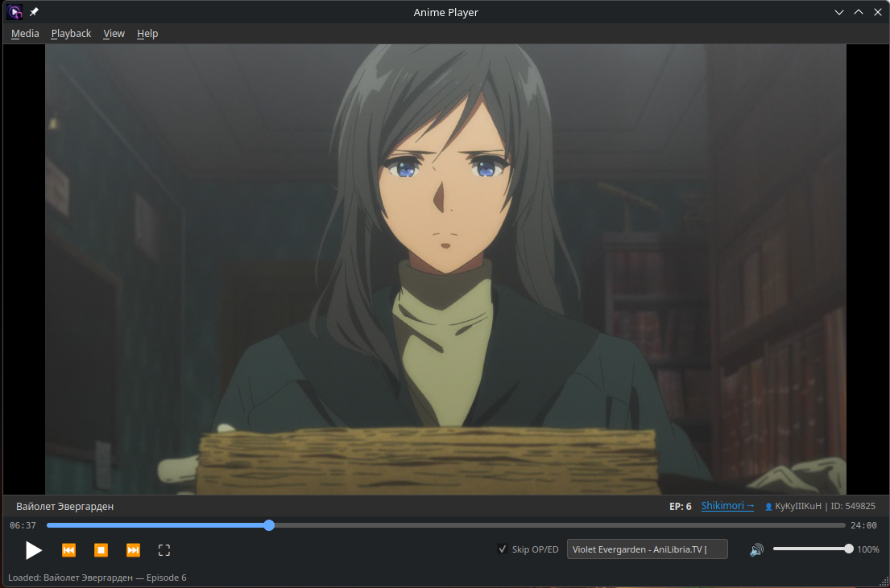

# AnimePlayer

Плеер для просмотра аниме с интеграцией shikimori.io и автоматическим пропуском OP/ED.

## Возможности

- **Локальное воспроизведение** — воспроизведение файлов .mkv, .mp4, .avi из выбранной папки
- **Интеграция с Shikimori** — информация об аниме и отправка прогресса просмотров в вашу библиотеку
- **Автоматический пропуск OP/ED** — автоматический пропуск заставок и концовок при включении
- **Сохранение состояния** — запоминает позицию последнего просмотра для каждого файла
- **Порядок эпизодов** — автоматическая сортировка файлов по сезонам/сериям

## Требования

- Python 3.11
- mpv (медиатека)
- Токен Shikimori API (для синхронизации)

## Разработка

1. Настройте файл `.env`, указав ваш `SHIKIMORI_TOKEN`
2. Запустите `AnimePlayer.sh` для запуска плеера

build_appimage.sh - Собирает AppImage, для этого нужен appimagetool-*.AppImage

Готовый файл AppImage можно найти по следующему пути: ./build/AnimePlayer-*.AppImage

## Использование

1. Нажмите **Папка** и выберите директорию с эпизодами аниме
2. Видео загрузится автоматически, начиная с последнего просмотренного файла
3. Используйте элементы управления для воспроизведения, пропуска эпизодов и регулировки громкости
4. Включите **Пропуск OP/ED** для автоматического пропуска заставок и концовок
5. Прогресс автоматически отправляется на shikimori.io при воспроизведении нового эпизода

## Технические детали

- **UI**: PySide6
- **Видеоплеер**: mpv (python-mpv)
- **API**: Shikimori API (информация о пользователе, поиск аниме, user rates), Anilibria API (таймкоды OP/ED)
- **Хранение состояния**: `playback_state.json`

## Зависимости

Описаны в файле requirements.txt

## Лицензия

MIT
